# Balanceador con NGINX 

## Aprovisionamiento

### Creamos los scripts de aprovisionamiento para las máquinas según su requerimiento, el script del nginx se compartirá para las dos máquinas.
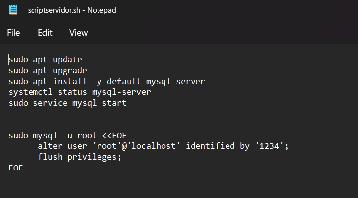

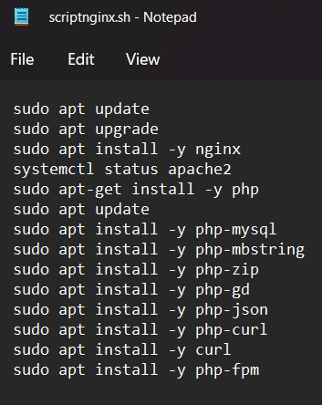

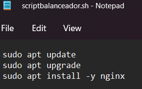

## VagrantFile
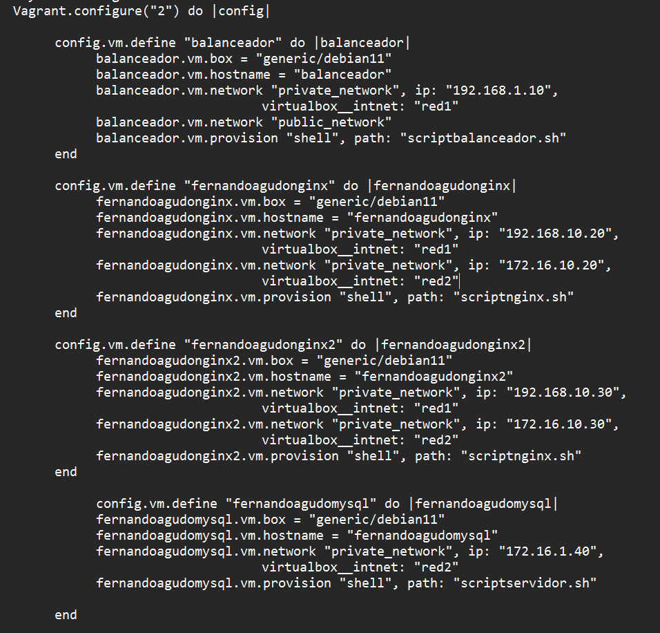

## Mysql
### En el servidor de SQL lo primero que tendremos que hacer es editar el archivo 50-server.cnf y poner la IP de la máquina.
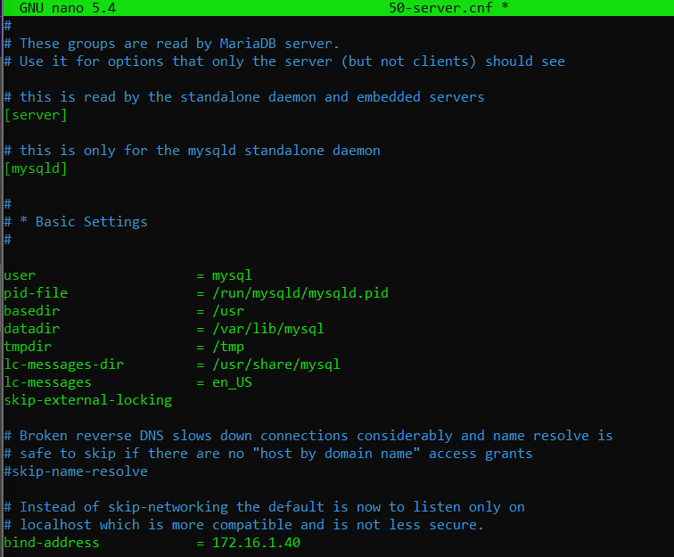

### Luego entraremos en MySQL y le daremos un usuario para ambas máquinas Nginx en la base de datos lamp_db
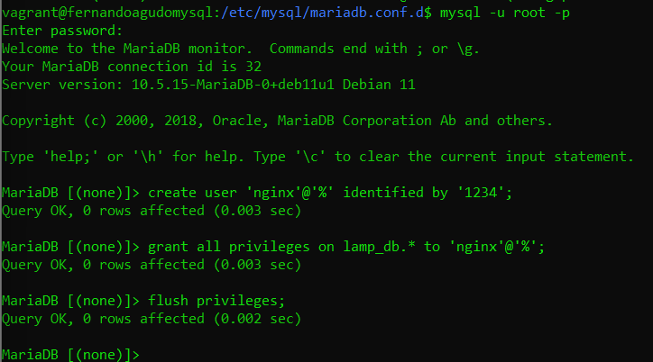

### Ahora clonamos la base de datos de la práctica de josejuansanchez, para borrar las 3 líneas de configuración que trae por defecto
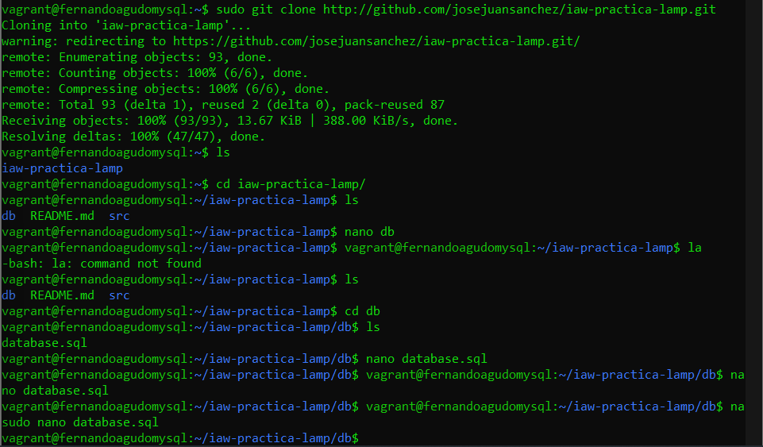
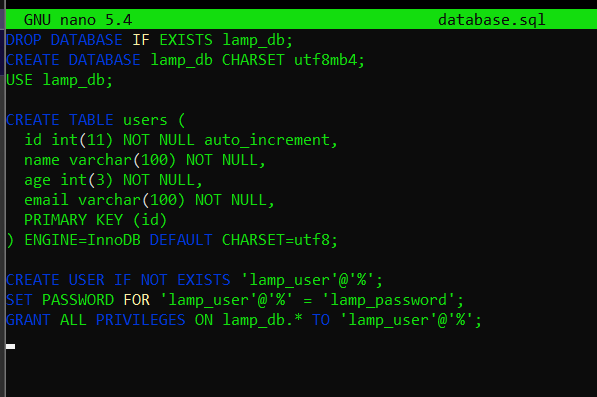

### A continuación, importamos la base de datos de la práctica de josejuan, y comprobamos que se ha importado correctamente. Tras esto, podremos borrar la carpeta de la práctica, ya que hemos cogido lo que necesitamos de ella
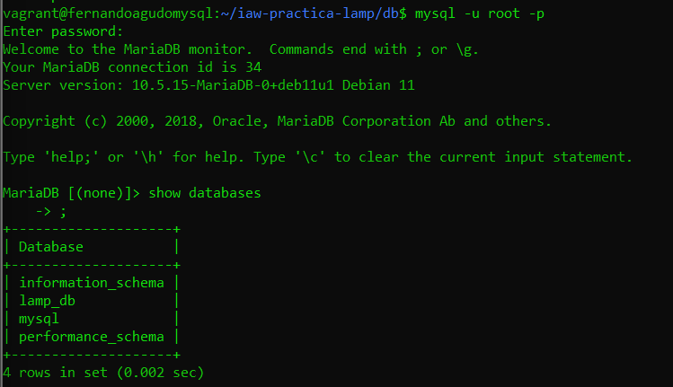

## Nginx

### Lo primero a hacer en las maquinas Nginx, es crear una carpeta con permisos para www-data y clonar la práctica y descomprimirla
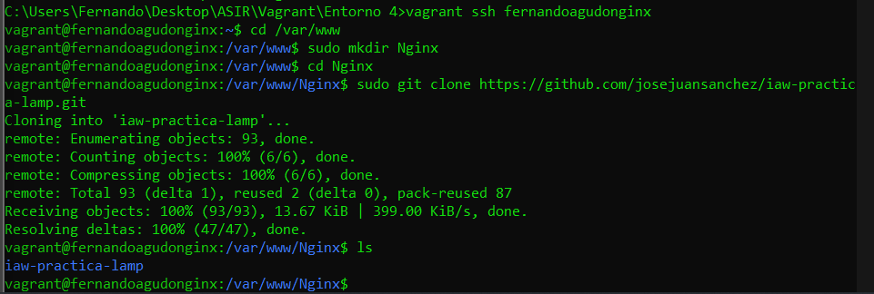

### Introducimos la IP del servidor SQL, y el usuario y la contraseña con los que vamos a acceder, que son los que creamos antes para estas máquinas nginx
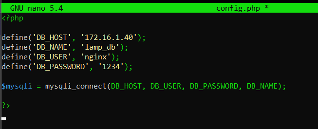

### También editamos el archivo conf, e indicamos que va a escuchar por el puerto 9000 en la 127.0.0.1
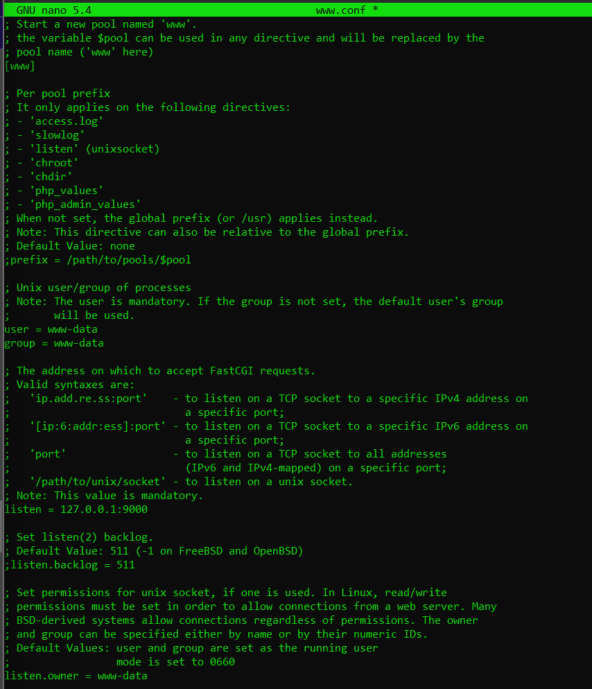

### Ahora copiamos el sitio default de sites available, y editamos el nginx para indicarle que vamos a usar un sitio tipo php
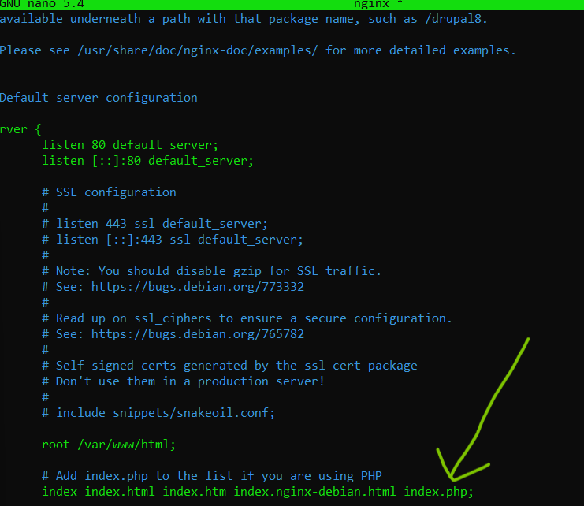

### Y también descomentamos las líneas que nos van a servir para utilizar el PHP y escuchar en su puerto
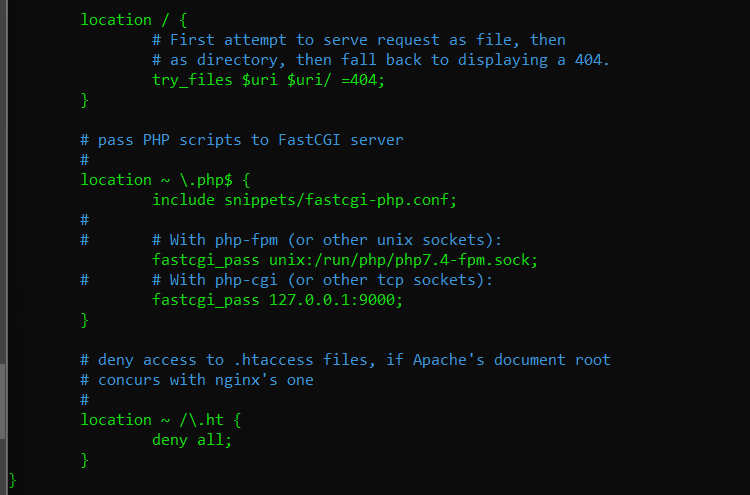

### Lo último que haremos en los nginx, será hacer un ln para tener un enlace en los sitios activos, y borrar el default.
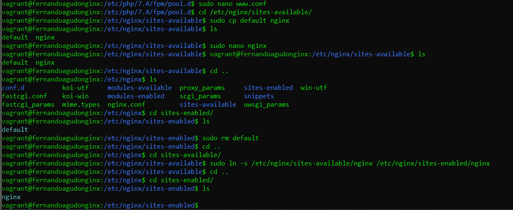

## Balanceador

### En el balanceador indicamos la ip de los servidores, y podremos acceder a la base de datos con la IP pública del balanceador
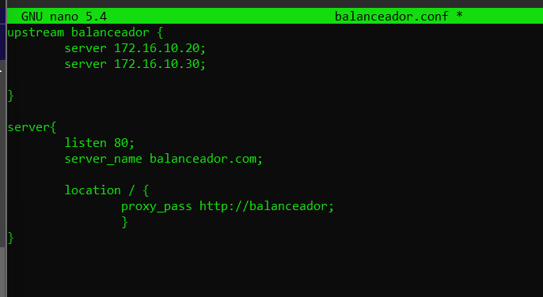
